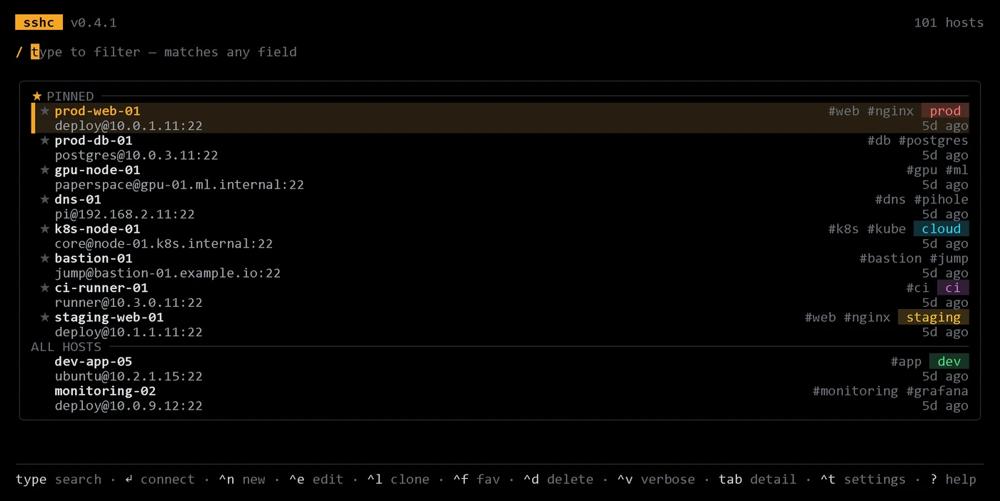

# sshc - SSH Connection Manager

A terminal SSH connection manager written in Go using the
[charmbracelet](https://github.com/charmbracelet) TUI stack. It parses your
`~/.ssh/config`, presents a fuzzy-searchable list, and - its core job -
**edits that file in place** to add, change, clone, and delete hosts, writing
safely back to disk (with backups and untouched blocks preserved byte-for-byte;
see [Write safety](#write-safety)).

Inspired by [quantumsheep/sshs](https://github.com/quantumsheep/sshs), with
first-class connection editing and a detail panel that surfaces every field of
the selected host at a glance.

<p align="center">
  
</p>

## Features

- Parse `~/.ssh/config` and additional files via `--config`
- `/etc/ssh/ssh_config` read-only fallback
- Fuzzy search across every field of a host - alias, address, user, tags, env
- A framed, search-first list with two-line rows, an accent-tinted selection,
  and `★ PINNED` / `ALL HOSTS` groups - switchable style (`--variant`), accent
  (`--theme`), and density (`--density`)
- **Per-host metadata:** tags, a free-form env label (coloured chip), and
  favourites (`★`), stored as a structured `#sshc …` comment that keeps the file
  valid for plain `ssh`
- Most-recently-used ordering with relative "… ago" labels; favourites float to
  the top
- Persistent TOML config (`os.UserConfigDir()/sshc/config.toml`) with a live,
  in-app settings overlay (<kbd>Ctrl</kbd>+<kbd>T</kbd>) that writes changes back
- Connect on <kbd>Enter</kbd> via a customizable exec template
- **Add / edit / delete / clone** connections with a guided form
- Toggleable detail panel showing every field plus the resolved `ssh` command
- Safe, backup-protected writes that never reformat untouched blocks

> **A word of caution.** sshc rewrites `~/.ssh/config` *in place* - the one file
> that every `ssh`, `scp`, `git`-over-ssh, and rsync session on your machine
> leans on. The safeguards under [Write safety](#write-safety) exist precisely
> because that file matters, and in normal use your config is safe and any write
> is recoverable from `.sshc.bak`. But this is software, software has bugs, and
> sshc is provided **as-is, with no warranty** (see [`LICENSE`](LICENSE)) - if a
> write ever mangles your config, recovering it is on you. Keep `~/.ssh/config`
> under version control or a backup you trust, and you'll never have a bad day
> over it.

## Install

```sh
go install github.com/totalizator/sshc@latest
```

Or build from source. Use the Makefile so the binary is stamped with the
version from `git describe` (shown by `--version` and in the TUI title):

```sh
make build          # -> ./sshc (or sshc.exe on Windows)
./sshc --version    # sshc v0.3.0
```

Without `make`, pass the ldflag yourself:

```sh
go build -ldflags "-X github.com/totalizator/sshc/cmd.version=v0.3.0" -o sshc .
```

A plain `go build` still works; the version then falls back to the embedded VCS
revision (e.g. `dev+a1b2c3d4`).

### Android / Termux

The prebuilt `linux/*` release binaries don't run under Termux - build from
source there instead. See [docs/android-termux.md](docs/android-termux.md) for
the why and the steps.

## Usage

```
sshc [flags]

Flags:
  --config string      SSH config path (repeatable; first is writable, rest read-only)
                       (default: ~/.ssh/config + /etc/ssh/ssh_config)
  --filter string      Pre-filter query on startup
  --template string    Exec template (default: ssh "{{{name}}}")
  --sort-name          Sort list alphabetically by alias
  --no-proxy           (legacy no-op; proxy now shows in verbose rows / detail)
  --theme string       Accent: amber | teal | green | magenta (default amber)
  --variant string     Style: minimal | framed | rich (default framed)
  --density string     Rows: comfortable | compact (default comfortable)
  --detail             Open the detail panel by default
  --no-pin             Do not float favourites to the top
  --verbose-rows       Show verbose rows by default
  -v, --version        Print version
```

### Commands

```
sshc clean [--dry-run]   Remove sshc's "#sshc …" metadata comments from the
                         writable config, returning it to plain-ssh form.
                         Favourites/tags/env/last-used are discarded; directives,
                         other comments, and indentation are left untouched, and
                         the original is backed up to <config>.sshc.bak first.
                         --dry-run reports the count without writing.
```

### Keys

The list is **search-first**: just start typing to filter by alias, address,
user, or any other field - there is no key to press first. Because typing
always searches, the mutating actions live on <kbd>Ctrl</kbd> combos.

| Key                   | Action                                      |
| --------------------- | ------------------------------------------- |
| *(type)*              | Filter the list (matches any field)         |
| <kbd>↑</kbd> / <kbd>↓</kbd> | Move selection                         |
| <kbd>Enter</kbd>      | Connect to selected host (prompts for a username if none is saved) |
| <kbd>Ctrl</kbd>+<kbd>N</kbd> | New connection                       |
| <kbd>Ctrl</kbd>+<kbd>E</kbd> | Edit selected                        |
| <kbd>Ctrl</kbd>+<kbd>L</kbd> | Clone selected (opens as a new entry) |
| <kbd>Ctrl</kbd>+<kbd>F</kbd> | Toggle favourite (pin to top)        |
| <kbd>Ctrl</kbd>+<kbd>D</kbd> | Delete selected (confirm)            |
| <kbd>Ctrl</kbd>+<kbd>V</kbd> | Toggle verbose rows (identity / proxy) |
| <kbd>Ctrl</kbd>+<kbd>T</kbd> | Settings overlay (live theme / style)  |
| <kbd>Tab</kbd>        | Toggle detail panel                         |
| <kbd>?</kbd> / <kbd>F1</kbd> | Toggle help (`?` when search is empty) |
| <kbd>Esc</kbd>        | Clear search, or quit when empty            |
| <kbd>Ctrl</kbd>+<kbd>C</kbd> | Quit                                 |

Each row shows `user@hostname:port` by default; <kbd>Ctrl</kbd>+<kbd>V</kbd>
expands rows with the identity file and proxy, and <kbd>Tab</kbd> opens a full
detail panel for the selected host.

In the add/edit form, move between fields with <kbd>↑</kbd>/<kbd>↓</kbd> or
<kbd>Tab</kbd>/<kbd>Shift</kbd>+<kbd>Tab</kbd>; <kbd>Enter</kbd> or
<kbd>Ctrl</kbd>+<kbd>S</kbd> saves and <kbd>Esc</kbd> cancels. Fields are Alias,
HostName, User, Port, IdentityFile, ProxyJump, **Tags** (comma-separated), and a
free-form **Env** label. Cloning (<kbd>Ctrl</kbd>+<kbd>L</kbd>) opens this form
pre-filled as a brand-new entry (named `<original>-copy`), so the original host
is left untouched until you save.

### Appearance & metadata

The default look is **framed · amber · comfortable**. Pick another with
`--variant minimal|framed|rich`, `--theme amber|teal|green|magenta`, and
`--density comfortable|compact`.

**Config file.** Settings persist in a TOML file at
`os.UserConfigDir()/sshc/config.toml` (e.g. `~/.config/sshc/config.toml`, or
`%AppData%\sshc\config.toml` on Windows). Precedence is **defaults → config
file → CLI flags**, so a flag is always a one-off override. Example:

```toml
[ui]
theme   = "teal"
variant = "framed"
density = "comfortable"
detail_default = false
pin_favorites  = true

# override or extend the env chip colours
[ui.env_colors]
edge = "#a78bfa"
```

**Live settings overlay.** Press <kbd>Ctrl</kbd>+<kbd>T</kbd> in the list to open
a settings panel - <kbd>↑</kbd>/<kbd>↓</kbd> move, <kbd>←</kbd>/<kbd>→</kbd>
change a value (the look updates live), and <kbd>Esc</kbd> closes and **writes
your choices back to the config file**.

Tags, env, and favourites are not native SSH keys, so sshc persists them as a
structured comment **on the `Host` line** - for example:

```
Host prod-web-01 #sshc env=prod tags=web,acme fav=1 used=1717000000
    HostName 10.0.4.21
    User deploy
```

Plain `ssh` ignores the comment, so the file stays fully compatible. Env chips
use a fixed colour for the presets `prod`, `staging`, `dev`, `home`, and `cloud`,
and a stable derived hue for any other value. Connecting stamps `used=` so the
list can order by most-recent-first (this best-effort write only touches the
primary, writable config).

### Template variables

| Variable         | Value         |
| ---------------- | ------------- |
| `{{{name}}}`     | Host alias    |
| `{{{hostname}}}` | HostName      |
| `{{{user}}}`     | User          |
| `{{{port}}}`     | Port (default 22) |

When you connect to a host that has no saved **User**, sshc prompts for a
username first (leave it blank to use ssh's own default). With the default
`ssh "{{{name}}}"` template the name is passed as `ssh -l <user> …`; a custom
template that includes `{{{user}}}` receives it there instead.

## Write safety

When you add, edit, or delete a host, sshc:

1. Re-reads the primary config from disk (external edits are picked up, not clobbered)
2. Applies the change to a parsed model
3. Re-parses the rendered result and aborts if it would be corrupt
4. Backs the original up to `<config>.sshc.bak`
5. Writes the new content

Only the **first** `--config` path is writable; all other configs and any
`Host *` / `Match` / wildcard blocks are read-only and excluded from edit and
delete. Untouched blocks keep their original whitespace, comments, and ordering
(with one caveat: the parser renders leading tabs as spaces on any round-trip).

A block sshc adds, edits, or clones is rewritten in conventional OpenSSH style -
directives indented four spaces under the `Host` line, separated from neighbours
by a blank line. This only ever reformats the block being changed; every other
block is preserved byte-for-byte.

Editing a host preserves everything sshc doesn't model: directives such as
`ForwardAgent` or `LocalForward`, inline comments, and quoted values stay
exactly as written - only the fields you change are touched.

## Troubleshooting

**`Ctrl+V` does nothing (Windows Terminal).** Windows Terminal binds `Ctrl+V`
to *paste*, so the verbose-rows toggle never reaches `sshc`. Two options:

- Use <kbd>Tab</kbd> instead - the detail panel shows the same extended fields
  (and more) for the selected host.
- Or unbind paste from `Ctrl+V` in Windows Terminal `settings.json`, which lets
  the key through to `sshc` (you keep `Ctrl+Shift+V` and right-click paste):

  ```json
  { "command": "unbound", "keys": "ctrl+v" }
  ```

## Development

```sh
go test ./...     # run tests
go vet ./...      # static checks
go build ./...    # build
```

## License

MIT
